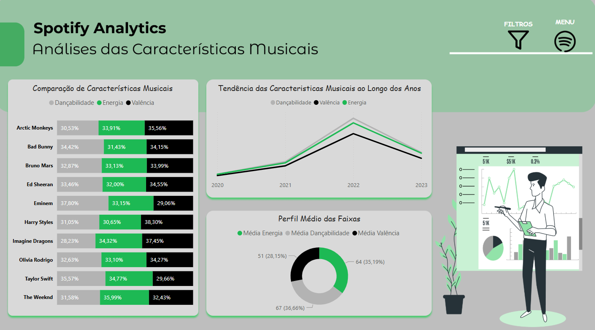
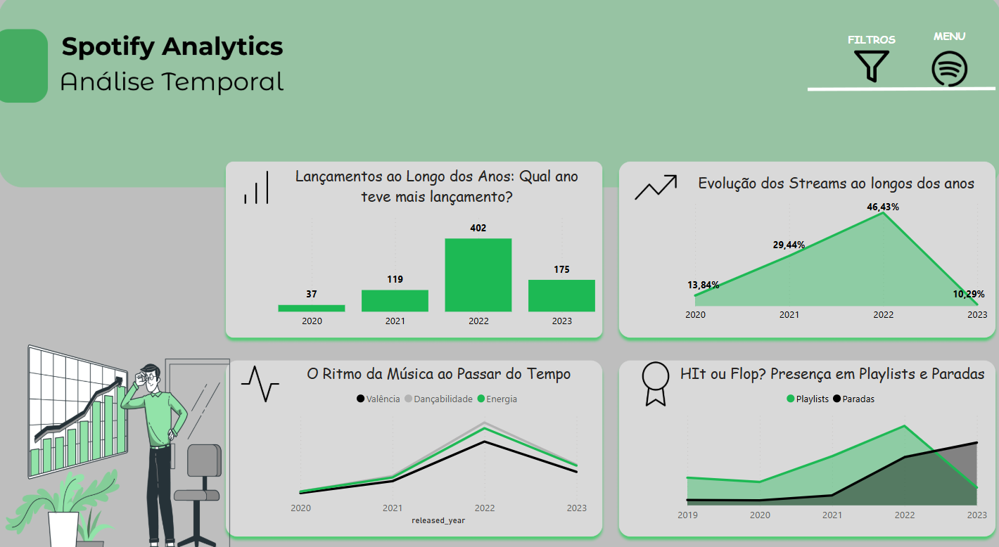

# 🎸Estudo Analítico do Consumo Musical no meio Digital - Data Science

#

## 📌 1. Objetivo do Projeto

Analisar as tendências musicais dos provedores de musicas por meio de técnicas de Ciência e Análise de Dados. Identificando padrões nas caracteristicas das musicas, comportamento das musicas ao longo do tempo e fatores que influenciam ao sucesso das músicas. Desta forma, esse estudo visa gerar insights relevantes sobre o mercado musical e apoiar tomadas de decisão baseadas em dados.

#

## 🛠️ 2. Tecnologias Utilizadas

* **Linguagem:** Python, SQL e DAX.

* **Bibliotecas:** `Pandas`, `Numpy`, `Matplotlib`, `Seaborn`.

* **Banco de Dados:** SQLite.

* **Painel de Visualização:** Power BI.

#

## 🔍 3. Principais Insights do Projeto

✅ **Concentração de Popularidade**

A popularidade (medida por reproduções e inclusão em playlists) é altamente concentrada em uma pequena parcela das músicas em todas as plataformas analisadas. A maioria das músicas possui baixo engajamento.

✅ **Diferença na visibilidade entre plataformas**

O Apple Music oferece, em média, uma visibilidade significativamente maior em playlists e charts em comparação com Spotify e Deezer, que apresentam médias de visibilidade baixas e comparáveis.

✅ **Energia Não é o Principal Fator e Popularidade**

A energia de uma música, por si só, não parece ser o fator determinante para um alto número de reproduções no conjunto de dados analisado. Outros fatores provavelmente têm maior influência.

✅ **Associações entre Características Musicais:**

Existem relações consistentes entre algumas características musicais, como a correlação positiva entre dançabilidade e energia, e a correlação negativa entre instrumentalidade e oralidade, que refletem padrões estilísticos e de produção.

✅ **Desafio da descoberta de artistas**

A dificuldade da maioria das músicas em obter um grande número de reproduções e inclusão em playlists ressalta o desafio da descoberta para novos artistas e músicas nas plataformas de streaming.

#

## 📈 4. Dashboards e suas Visualizações

A partir da etapas de analises exploratorias (EDA) foi identificado a necessidade de focar esforços analiticos em compreender o comportamento dos numeros em um unico provedor. Desta forma, escolhi os dados do Spotify para realizar essa análise mais aprofundada para identificarmos como as musicas estão se comportando nessa plataforma. As visões criadas são:

### 4.1 **Resumo**

Esta página tem como objetivo apresentar um resumo analítico e visual do desempenho musical em plataformas de streaming, com ênfase no Spotify. O painel permite visualizar as músicas e artistas com maior número de streams, comparar presença nas plataformas Spotify, Apple e Deezer, e observar padrões de lançamentos ao longo do tempo.

* **Principais Análises**

    * Músicas com Mais Streams:

        * Identificação das faixas mais populares em termos de número total de reproduções.

        * Insights sobre a dominância de determinados hits globais no período analisado.

    * Artistas com Mais Streams:

        * Destaque para os artistas com maior alcance e engajamento no Spotify.

        * Permite compreender quem são os líderes em termos de audiência acumulada.

    * Comparativo nas Plataformas (Spotify x Apple x Deezer)

        * Comparação da visibilidade de artistas entre as três principais plataformas de música.

        * Indicação da preferência ou melhor desempenho dos artistas em determinadas plataformas.

    * Total de Músicas Lançadas por Ano

        * Análise temporal dos lançamentos ao longo dos anos.

        * Possibilita detectar tendências de aumento ou queda na produção musical.

    * Quantidade de Faixas por Artista

       * Quantificação da presença dos artistas na base de dados.

       * Permite cruzar com os dados de streams para avaliar produtividade versus popularidade.

### 4.2 **Características Musicais**

Esta página tem como objetivo analisar as características sonoras das músicas dos artistas mais populares, identificando padrões em atributos como dancabilidade, energia e valência (positividade). As análises permitem entender o estilo musical predominante por artista e como essas características evoluíram ao longo do tempo.

* **Principais análise**

    * Comparação de Características Musicais por Artista

        * Compara a dancabilidade, energia e valência das faixas de cada artista.

        * Permite observar estilos predominantes (ex: artistas mais dançantes ou mais energéticos).

    *  Tendência das Características Musicais ao Longo dos Anos

        * Apresenta a evolução anual das características sonoras de forma geral.

        * Identifica possíveis mudanças nas preferências musicais com o passar do tempo (ex: músicas mais alegres em 2022).

    * Perfil Médio das Faixas

        * Mostra a distribuição média dos três principais atributos das músicas analisadas.

        * Permite visualizar qual característica tem maior presença nas faixas em geral.

### 4.3 **Análise Temporal**

Esta página tem como foco a análise temporal dos dados musicais, observando padrões de lançamentos, streams, tendências sonoras e desempenho nas playlists e paradas. O objetivo é entender como a indústria musical tem se comportado ao longo dos anos e identificar períodos com maior impacto musical. 

* **Principais Análises**

    * Lançamentos ao Longo dos Anos

        * Mostra o volume de lançamentos por ano.

        * O ano de 2022 se destaca com maior número de lançamentos, o que pode indicar um pico criativo ou estratégia de mercado.

    * Evolução dos Streams

        * Exibe a porcentagem de streams por ano.

        * Identifica os anos com maior consumo musical, destacando 2022 como o ano de maior pico (46,43%).

    * Ritmo da Música ao Passar do Tempo

        * Analisa a evolução das características sonoras (valência, dancabilidade e energia) com o tempo.

        * Mostra como o estilo das músicas mudou ao longo dos ano

    * Hit ou Flop? Presença em Playlists e Paradas

        * Compara a presença das faixas em playlists populares e rankings (paradas).

        * Ajuda a identificar se as músicas estão tendo mais reconhecimento pelo algoritmo (playlists) ou pelo público (paradas).

# 

## ✍🏽 5. Conclusão

O projeto **Estudo Analítico do Consumo Musical no meio Digital - Data Science** proporcionou uma visão abrangente sobre padrões musicais e comportamentos temporais no cenário musical recente. Através da análise de características como energia, dancabilidade e valência, foi possível identificar tendências sonoras por artista e ao longo dos anos. Além disso, a análise temporal evidenciou os picos de lançamentos, evolução dos streams e o desempenho das faixas em playlists e paradas, oferecendo insights relevantes sobre o que torna uma música um sucesso na plataforma.
